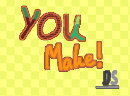
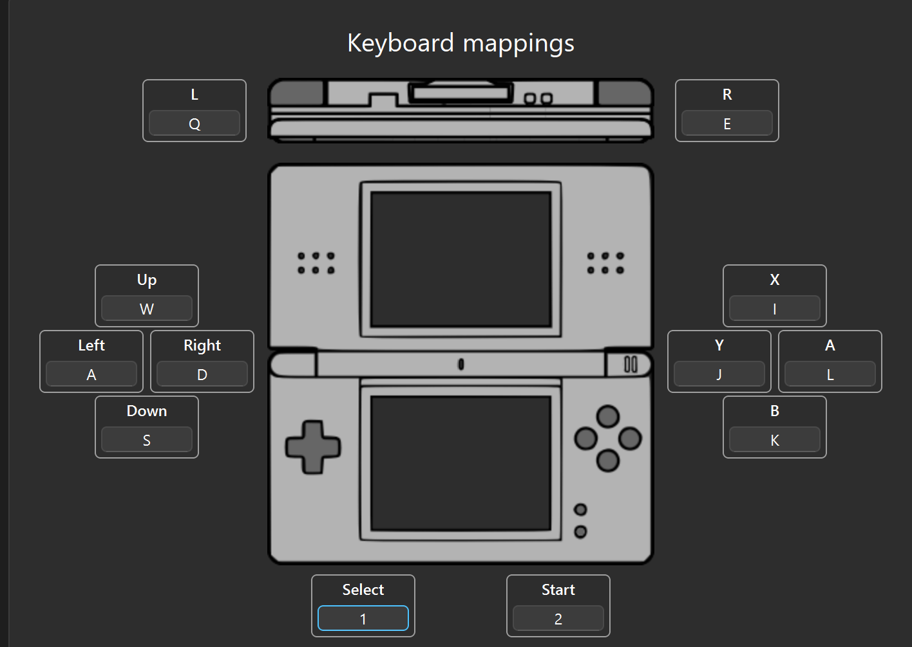
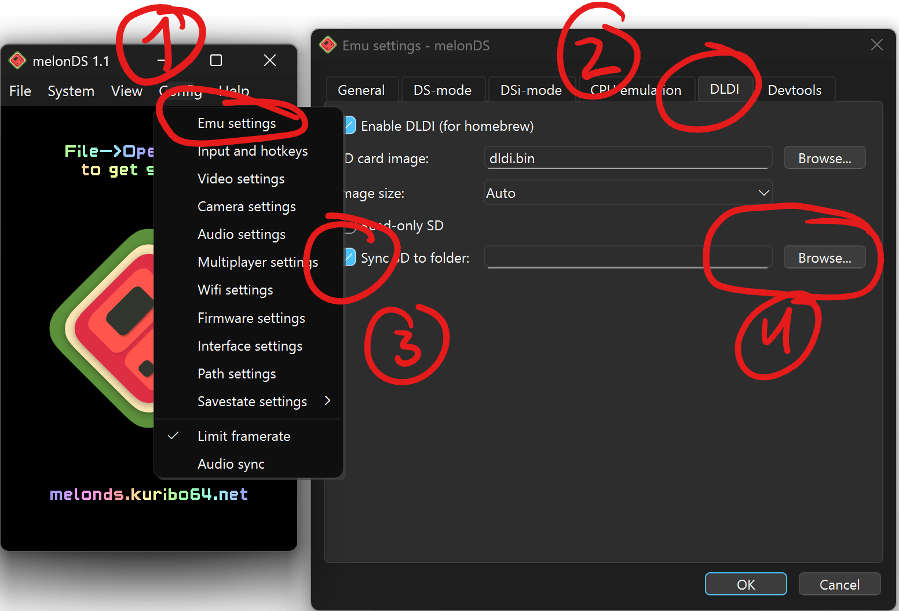
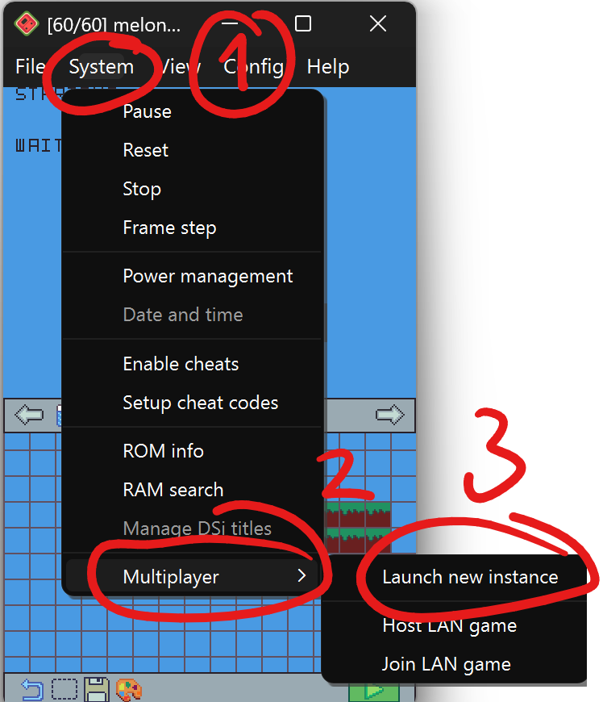

# You Make! DS

# What is this?
You Make! DS is a homebrew game for the Nintendo DS inspired by Mario Maker. 

It features a level editor where the limit is your creativity (as long as your creativity fits within 250 thousand tiles), a way to play your level, as well as saving your level and being able to load it back up when you feel like working on it again!

It also features a way to share levels locally that is currently in development but an early version of it is currently shipped with the game.

This project taught me a ton about programming for the DS, as well as the fact that it made me write better C code and expose myself with different parts of the language that I previously was too scared to try.

# How to play on a DS

Download the .nds file found in the    [Releases](https://github.com/nikoi008/Legally-distinct-platformer-maker-DS/releases) tab, and put it in a flashcart of choice. Make sure that it is [DLDI patched](https://gbatemp.net/threads/what-is-dldi-and-how-do-i-use-it.288079/) if not already

# How to play on an emulator

I have included the windows release of [melonDS](https://melonds.kuribo64.net/) ([source](https://github.com/melonDS-emu/melonDS)) with a config file that contains an existing empty SD card image as well as configured controls. The rom is also provided. In order to run the game press File->Open ROM and select the .nds file

The control scheme is below 


## How to transfer levels from melonDS to a DS
In order to do that you must first sync your SD card to a folder. This is done by going to Config->Emu Settings and then clicking the DLDI tab. From there check the box that says "sync SD to folder" and click "Browse" to select the folder you want to sync it to.

From there, the levels will appear in the YouMakeLevels folder. Copy over the folder to the root of the flashcart's SD card and your levels will be transfered

Here is a visual example of how to sync the virtual SD card to a folder 

## How to test local level sharing
You must go to System->Multiplayer->Launch new instance, and open the rom again on the window titled [p2]
Here is a visual example of how to launch the instance  
> Please keep in mind that the level sharing is still in a very early state, with support of a maximum of less than 10 thousand tiles sent

# Libraries used
This project is entirely written in C using [blocksDS](https://github.com/blocksds/sdk) as the main development library, which contains [DSWifi](https://github.com/blocksds/dswifi), the wifi library I used, and [NFLib](https://github.com/knightfox75/nds_nflib) (NightFox's Lib) as the graphics library

# How to build
As said, you must have [blocksDS](https://github.com/blocksds/sdk) and [NFLib](https://github.com/knightfox75/nds_nflib) installed, and then you can compile with the makefile provided using ```make```

# License
This game is licensed under the [MIT License](https://opensource.org/licenses/MIT) and [melonDS](https://github.com/melonDS-emu/melonDS) is licensed under the [GNU GPL license](https://www.gnu.org/licenses/gpl-3.0.html)